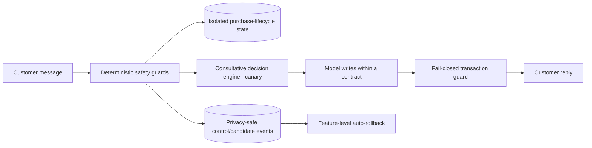

# Consultative Sales Assistant — Staged-Rollout Architecture

Public showcase of the safety architecture behind moving a live, multi-channel WooCommerce sales assistant from a single prompt-driven model toward a deterministic, auditable sales-decision engine — without a big-bang change to a system that is already holding real customer conversations across the web and messaging channels.

## Current milestone

Version 0.1.0 documents the rollout discipline rather than the product. A set of deterministic safety guards was deployed to Production **switched off**, proven inert against live traffic, and only then raised behind independent, conversation-sticky feature flags. The consultative decision engine runs in shadow, and for a small fraction of real conversations as prompt-level and post-response guardrails. No prompt, model, pricing rule, or customer record was replaced in a single step.

No proprietary prompt, business rule, credential, or customer data appears in this repository. It describes how the change was made safe, not what the assistant says.

## What this milestone delivers

- A read-only, evidence-based audit that named the actual causes of weak behavior before a line of production code was touched
- Deterministic safety guards that only ever *remove* unsafe behavior, deployed inert and canaried one feature at a time
- A fail-closed transaction-claim guard: no "order placed", "paid", or "reserved" reaches a customer without a matching successful tool result
- A post-purchase boundary that closes the sales cycle once a customer has bought and confirmed delivery
- Follow-up messages revalidated at send time against the current purchase state
- Persisted purchase-lifecycle state, isolated from the customer profile store
- A privacy-safe event stream — hashed conversation and product identifiers, whitelisted fields — that separates a control cohort from a candidate cohort
- Feature-level automatic rollback, and a regression and adversarial-review suite that gates every stage

## A governor that ships switched off

The safest moment to discover that a new guardrail is wrong is before it can touch a customer. So every deterministic guard was written to be deployed to Production doing nothing at all: the flags default to an empty allowlist and zero percent, and the deploy itself is verified to change no live reply. Only once the running service was observed to be genuinely inert were the guards raised — and even then, the ones that merely *suppress* unsafe output went first, because a guard that can only remove a bad answer cannot introduce a worse one.

State capture was allowed to run from the first deploy, because writing to an isolated store changes nothing a customer sees. By the time a gate was switched on, the state it needed to decide had already been accumulating.

## The claim that must never ship

A sales assistant that says "your order is placed" when nothing was placed is worse than one that says nothing. The transaction-claim guard treats every such phrase — placed, reserved, paid, invoiced, shipped — as forbidden unless the current turn produced a matching successful tool result. It is fail-*closed*: if the guard itself errors and cannot prove the claim is backed, the claim is replaced with a safe holding message rather than allowed through. The one thing it will never do on failure is let an unverified financial or order claim reach the customer.

## Selling after the sale is over

The audit found the assistant continuing to pitch products after a customer had thanked it, said goodbye, or confirmed their watch had arrived — because nothing in the live path knew a purchase had happened. Purchase and delivery are now persisted as an explicit lifecycle, sourced with priority (a successful tool beats a store status beats an explicit customer message beats a text inference), and an ambiguous signal is deliberately not treated as proof. A deterministic gate reads that state before the model is prompted: past delivery, product search and sales calls-to-action are refused and the assistant is steered to acknowledgement and support, and a new sales cycle opens only on an explicit new-purchase intent. The same state revalidates every follow-up at send time, so a nudge queued before a purchase is suppressed rather than delivered after it.

## Deciding in the open, not inside the prompt

The original assistant made its sales decisions inside a large persona prompt: several rules independently insisted on a call-to-action, and product recommendations arrived before the customer's need was understood. The redesign moves the *decision* — ask a clarifying question, recommend a bounded set with reasons, recover from a dead end, or hand off — into a deterministic engine, and leaves the model to write within a contract it does not get to override. That engine reached real conversations as a five-percent, conversation-sticky canary, so a customer is only ever on one side of the experiment and never switches mid-conversation.

## What we measured before we changed anything

The change began with a read-only audit that was not allowed to modify a single file, and every claim in it had to be backed by real behavior. It found that roughly half of live replies carried a sales call-to-action, that the live model and the consultative engine agreed on only a small minority of turns, and that recommendations were frequently made before the need was understood. Those numbers, not an opinion, set the order of the fixes.

## Guards you can retire one at a time

Each canaried capability carries its own flag and its own rollback. A hard trigger — an unsupported transaction claim, a product pitched into a post-purchase turn, a follow-up sent after a purchase — returns only the offending feature to zero percent, writes an incident record, and leaves every other guard and the proven-safe path untouched. Aggregate triggers watch candidate error rate and latency against the control cohort. The customer's conversation is never stopped, and the transaction guard stays fail-closed throughout.

## What the architecture improves

- Sales decisions made by a deterministic, testable engine instead of competing rules inside one prompt
- A live cycle that knows when a purchase is complete, and stops selling into it
- Follow-ups validated against current state at send time rather than fired on a timer
- Financial and order claims that are provably backed by a tool result or are not made at all
- Rejected products excluded from later recommendations, and zero-price "call for availability" items reported as unavailable rather than in stock
- Progressive delivery: shadow first, inert deploy, per-feature canary, conversation-sticky assignment, feature-level rollback
- Privacy-safe measurement that never records raw customer text, contact details, or real identifiers

## High-level boundary

## Safeguards

- Guards deploy inert and are proven to change no live reply before any flag is raised.
- Publishing is treated as the one irreversible action: this repository is an allowlist of documentation, checked before every push by a fail-closed scanner that reports categories and never echoes the content it flags.
- The private implementation, its prompts, pricing rules, credentials, and customer data remain outside this repository.
